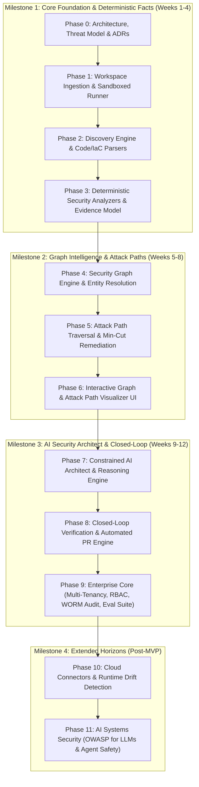

# AI Security Architect — Master Implementation Roadmap

**Document Owner:** Enterprise Security Architecture Team  
**Target State:** Production-Ready, Multi-Tenant Security Architecture & Attack-Path Analysis Platform

---

# 1. Executive Summary

**AI Security Architect** is an enterprise security reasoning platform that continuously builds, queries, and analyzes a multi-layered security graph across an organization's:

* Source Code & ASTs
* APIs & Endpoints
* Software Dependencies (SCA)
* Container Images & Dockerfiles
* Kubernetes Manifests & Cluster Resources
* Infrastructure-as-Code (Terraform, CloudFormation)
* Identities, Roles & Permissions (IAM / RBAC)
* Sensitive Data Assets (Databases, Buckets, Queues)
* Existing Security Controls & Policies

It combines **deterministic security analysis** with **graph-based attack-path reasoning** and **constrained AI intelligence**.

### The Non-Negotiable Core Axiom

> **Deterministic systems establish security facts. The graph establishes relationships. The AI reasons over those facts.**

The LLM is **never the source of truth** for:
* Vulnerabilities and CVEs
* Asset topologies and relationships
* Reachability and network exposure
* Permissions and IAM policies
* Base severity scoring
* Cryptographic evidence
* Remediation validation

---

# 2. Product Vision & Value Pipeline

The platform answers the central enterprise security question:

> **"Given this organization's software and infrastructure, what can an attacker realistically reach, why can they reach it, what is the business impact, and what is the smallest effective remediation?"**

```text
Code + Infrastructure (Static & IaC)
                ↓
    Deterministic Facts & Evidence
                ↓
          Security Graph
                ↓
      Attack Path Engine (Traversal)
                ↓
    Contextual Risk & Choke Points
                ↓
    Constrained AI Security Architect
                ↓
      Verified Closed-Loop Remediation
```

---

# 3. North-Star System Architecture

```text
                         ┌─────────────────────────────────────────┐
                         │         Web Dashboard / UI             │
                         │ Interactive Canvas • Graph • Risk • AI │
                         └────────────────────┬────────────────────┘
                                              │ API / WebSocket
                         ┌────────────────────▼────────────────────┐
                         │              Control Plane              │
                         │    Multi-Tenant • RBAC • Audit • API   │
                         └────────────────────┬────────────────────┘
                                              │
             ┌────────────────────────────────┼────────────────────────────────┐
             │                                │                                │
             ▼                                ▼                                ▼
    Discovery Engine                 Security Analyzers                Reasoning & AI
(AST, IaC, K8s, Container)        (Gitleaks, Trivy, Checkov)        (Context Builder, Schema)
             │                                │                                │
             └────────────────────────────────┼────────────────────────────────┘
                                              ▼
                                   ┌────────────────────┐
                                   │   Security Graph   │
                                   │ Adjacency • Relational │
                                   └──────────┬─────────┘
                                              │
                                              ▼
                                   ┌────────────────────┐
                                   │ Attack Path Engine │
                                   │ Traversal • Scoring│
                                   └──────────┬─────────┘
                                              │
                                              ▼
                                   ┌────────────────────┐
                                   │ Min-Cut Optimizer  │
                                   │ Choke-Point Engine │
                                   └──────────┬─────────┘
                                              │
                                              ▼
                                   ┌────────────────────┐
                                   │ AI Security        │
                                   │ Architect Agent    │
                                   └──────────┬─────────┘
                                              │
                                              ▼
                                   ┌────────────────────┐
                                   │ Remediation        │
                                   │ Verification Loop  │
                                   └────────────────────┘
```

---

# 4. Aligned 12-Phase Master Roadmap

The roadmap is organized into **4 Progressive Milestones** with clear stage gates:



---

## Milestone 1: Core Foundation & Deterministic Facts (Weeks 1–4)

### Phase 0 — Architecture, Threat Model, Domain Contracts & ADRs (Days 1–4)
* **Goal**: Establish the engineering foundations, canonical data models, and architectural boundaries.
* **Deliverables**:
  * Architecture Decision Records (ADR-001 to ADR-007).
  * Canonical Domain Models: `Asset`, `Relationship`, `Finding`, `Evidence`, `AttackPath`, `AIContract`.
  * Threat model for untrusted repository scanning and prompt injection boundaries.
  * Zod / JSON Schema validation definitions for all data exchange.
* **Definition of Done**: All core contracts compile and validate against strict schema tests.

### Phase 1 — Platform Foundation & Sandboxed Ingestion (Weeks 1–2)
* **Goal**: Ingest repositories securely into ephemeral, isolated execution environments.
* **Deliverables**:
  * Repository acquisition manager (GitHub clone/webhook).
  * Ephemeral workspace manager with sandboxing guarantees (read-only base, dropped privileges, timeout/PID limits).
  * Async job coordinator for scan tracking.
* **Definition of Done**: Untrusted repositories clone into ephemeral sandboxes and clean up reliably.

### Phase 2 — Discovery Engine & Code/IaC AST Extraction (Weeks 2–3)
* **Goal**: Extract structural application, container, and infrastructure topology from codebases.
* **Deliverables**:
  * Application AST extractors (Java/Spring Boot, Python, TypeScript controllers & endpoints).
  * Infrastructure parsers (Terraform HCL AST, Kubernetes YAML manifests, Dockerfiles).
  * Dependency extractors (Maven `pom.xml`, NPM `package.json`, Python `requirements.txt`).
* **Definition of Done**: Sample multi-tier repository outputs structured assets representing all components and exposed interfaces.

### Phase 3 — Deterministic Security Analyzers & Evidence Model (Weeks 3–4)
* **Goal**: Integrate best-in-class security scanners and normalize findings into cryptographically verifiable evidence.
* **Deliverables**:
  * Pluggable `SecurityAnalyzer` interface.
  * Normalizers for Gitleaks (secrets), Trivy/OSV (SCA/containers), Checkov/TFLint (IaC), and Semgrep (SAST).
  * Immutable Evidence Generator: file paths, line ranges, snippet hashes, and scanner signatures.
* **Definition of Done**: All scanner outputs are converted into canonical `Finding` entities backed by immutable `Evidence`.

---

## Milestone 2: Graph Intelligence & Attack Paths (Weeks 5–8)

### Phase 4 — Security Graph Engine & Cross-Layer Entity Resolution (Weeks 5–6)
* **Goal**: Construct the unified security graph linking code, infrastructure, identity, and vulnerabilities.
* **Deliverables**:
  * Graph data engine supporting fast adjacency traversal and recursive queries.
  * Cross-layer Entity Resolution:
    * Spring Controller $\to$ K8s Service $\to$ K8s ServiceAccount $\to$ AWS IAM Role $\to$ S3 Bucket.
  * Relationship classification: `DECLARED`, `OBSERVED`, and `INFERRED` with confidence scoring.
* **Definition of Done**: Graph correctly stitches code-level entry points to infrastructure and sensitive data stores.

### Phase 5 — Attack Path Traversal & Min-Cut Remediation Engine (Weeks 7–8)
* **Goal**: Compute realistic exploit chains from entry points to crown jewels and calculate optimal choke-point fixes.
* **Deliverables**:
  * Entry point detection (`INTERNET`, `PUBLIC_API`, `EXPOSED_STORAGE`) and sensitive target labeling (`PII`, `SECRETS`, `DB`).
  * Graph traversal algorithms calculating end-to-end attack paths.
  * Explainable Risk Scoring: $\text{Risk} = \text{Impact} \times \text{Exploitability} \times \text{Reachability} \times \text{Asset Criticality} \times \text{Confidence}$.
  * Weighted Min-Cut / Choke-Point Optimizer identifying the single change that breaks the highest number of critical paths.
* **Definition of Done**: Engine detects multi-step attack paths on reference fixtures and computes the optimal choke-point remediation edge.

### Phase 6 — Interactive Graph & Attack Path Visualizer UI (Week 8)
* **Goal**: Provide a clean, high-performance visual canvas for security architects and engineers.
* **Deliverables**:
  * React + TypeScript web application with React Flow canvas.
  * Node inspection panel (asset details, technology, associated findings, reachability status).
  * Visual attack path highlighting and choke-point indicators.
  * Search, filter, and blast-radius exploration controls.
* **Definition of Done**: User can visually navigate the security graph, click attack paths, and inspect evidence in the browser.

---

## Milestone 3: AI Security Architect & Closed-Loop Remediation (Weeks 9–12)

### Phase 7 — Constrained AI Security Architect & Reasoning Engine (Weeks 9–10)
* **Goal**: Provide deep architectural security reasoning without hallucination or secret leakage.
* **Deliverables**:
  * Privacy Boundary & Context Builder: secret redaction, sensitive token stripping, graph-chain extraction.
  * Strictly typed AI Handoff & Output JSON Schemas.
  * LLM reasoning engine generating root-cause analysis, business impact, and targeted remediation patches.
* **Definition of Done**: AI produces valid, schema-compliant remediation proposals referencing only verified graph facts and evidence.

### Phase 8 — Closed-Loop Remediation Verification & Automated PR Engine (Weeks 10–11)
* **Goal**: Verify that proposed fixes mathematically eliminate attack paths before human review or PR creation.
* **Deliverables**:
  * Automated patch applier and ephemeral branch runner.
  * Re-scan and graph recalculation pipeline.
  * Verification status check (`SECURITY_REMEDIATION_RESOLVED` vs. `SECURITY_REMEDIATION_FAILED`).
  * Automated GitHub Pull Request creator with verification badges and evidence attachments.
* **Definition of Done**: System generates a patch, re-evaluates the graph, confirms attack-path breakage, and opens a verified PR.

### Phase 9 — Enterprise Core & Evaluation Framework (Weeks 11–12)
* **Goal**: Harden for enterprise multi-tenancy, compliance, and automated regression testing.
* **Deliverables**:
  * PostgreSQL Row-Level Security (RLS) and resource-scoped RBAC.
  * WORM (Write-Once-Read-Many) append-only audit event logging.
  * OpenTelemetry distributed tracing and metrics.
  * Benchmark evaluation suite containing 50+ real-world attack scenarios (CI passes/fails on regression).
* **Definition of Done**: MVP is fully enterprise-ready, multi-tenant isolated, and verified against the fixture benchmark suite.

---

## Milestone 4: Extended Horizons (Post-MVP)

### Phase 10 — Cloud Connectors & Runtime Drift Detection
* **Goal**: Connect live cloud APIs (AWS, Azure, GCP) and runtime telemetry (eBPF / OpenTelemetry) into the graph.
* **Deliverables**:
  * Cloud IAM and infrastructure ingestion.
  * Drift detection: IaC declared permissions vs. Cloud active effective permissions.
  * Dynamic relationship tagging (`OBSERVED` network traffic vs. `DECLARED` configurations).

### Phase 11 — AI Systems Security (OWASP Top 10 for LLMs)
* **Goal**: Extend the security graph to model AI agents, vector databases, and prompt flows.
* **Deliverables**:
  * AI application scanners (LangChain, LlamaIndex, Semantic Kernel topology extraction).
  * Threat detection: Prompt injection paths, unsafe tool invocation permissions, RAG data leakage, and excessive agency.

---

# 5. Golden Reference Architecture Fixture (001-ssrf-iam-s3)

To validate the platform end-to-end across every phase, we maintain a baseline fixture:

```text
[INTERNET]
    ↓ (HTTP Exposure)
[AWS Application Load Balancer] (alb.tf)
    ↓ (Routes to)
[Spring Boot Order Service] (OrderController.java)
    ↓ (SSRF Vulnerability in /webhook endpoint)
[Kubernetes Pod / ServiceAccount] (deployment.yaml)
    ↓ (EKS Pod Identity / Role Assumption)
[AWS IAM Role: order-service-role] (iam.tf with wildcard s3:*)
    ↓ (CAN_READ / CAN_WRITE)
[AWS S3 Bucket: customer-pii-production] (s3.tf)
    ↓ (Contains)
[Crown Jewel: Customer PII Data]
```

### Expected Platform Behavior:
1. **Discovery**: Identifies Spring Boot app, ALB, K8s Pod, IAM Role, and S3 Bucket.
2. **Analysis**: Flags SSRF in code, missing IMDSv2 protection, and wildcard IAM policy.
3. **Graph & Path**: Traverses path from `INTERNET` to `Customer PII Data`.
4. **Min-Cut**: Recommends restricting IAM role policy as the highest-leverage choke point.
5. **AI Architect**: Generates least-privilege IAM policy patch and IMDSv2 enforcement.
6. **Closed-Loop Verification**: Applies patch, re-scans graph, confirms path is broken, and issues verified PR.
